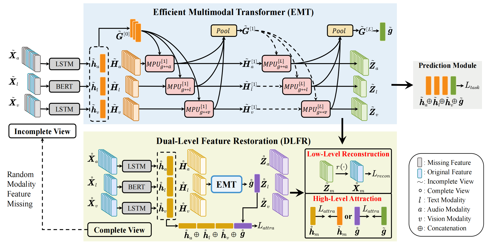
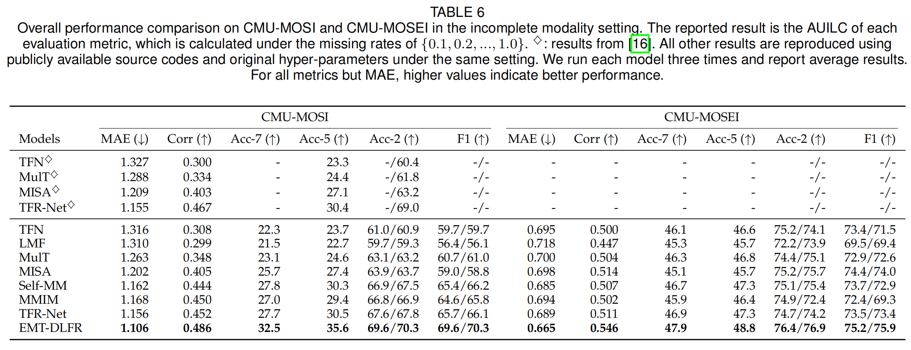
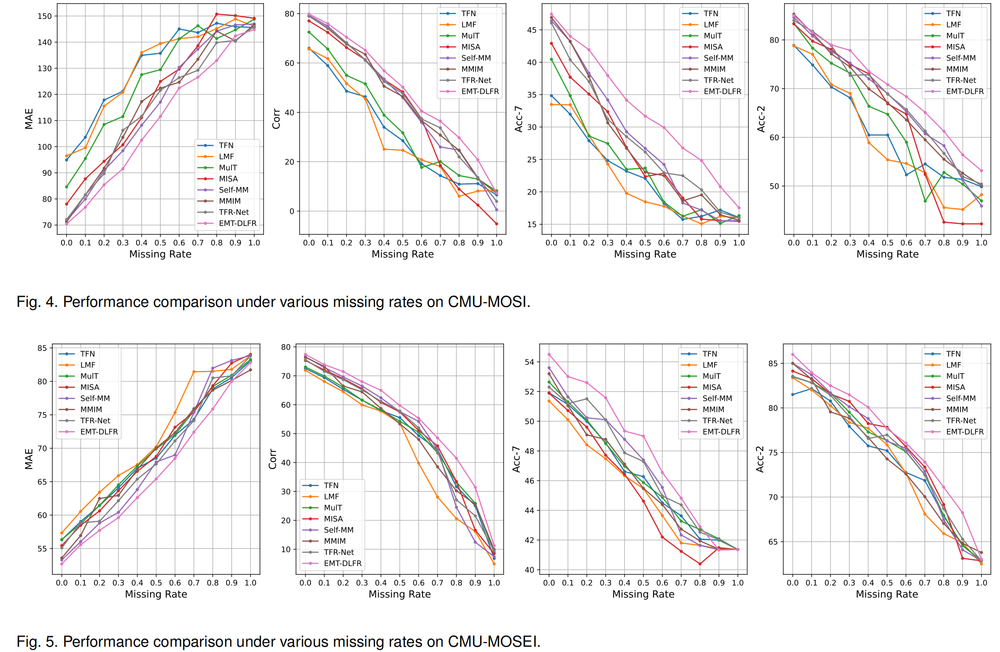

# EMT-DLFR
> [**Efficient Multimodal Transformer with Dual-Level Feature Restoration for Robust Multimodal Sentiment Analysis (TAC 2023)**](https://ieeexplore.ieee.org/document/10122560)<br>
> [Licai Sun](https://scholar.google.com/citations?user=7qo_cTcAAAAJ&hl=en&oi=ao), [Zheng Lian](https://scholar.google.com/citations?user=S34nWz0AAAAJ&hl=en), [Bin Liu](https://scholar.google.com/citations?user=UEB_5QEAAAAJ&hl=en), and [Jianhua Tao](https://scholar.google.com/citations?user=781jbHMAAAAJ&hl=en)<br>
> University of Chinese Academy of Sciences & Institute of Automation, Chinese Academy of Sciences & Tsinghua University<br>

## Overview



In this paper, we aims to tackle two major challenges on the way towards robust multimodal sentiment analysis (MSA): 
- *inefficiency* when modeling cross-modal interactions in unaligned multimodal data.
- *vulnerability* to random modality feature missing which typically occurs in realistic settings.

To this end, we propose Efficient Multimodal Transformer with Dual-Level Feature Restoration (EMT-DLFR):
- Efficient Multimodal Transformer (EMT). EMT introduces the *global multimodal context* and employs it to interact with *local unimodal features* to enable efficient *global-local* cross-modal interaction, which not only avoids the quadratic scaling cost of previous *local-local* interaction methods (e.g., [MulT](https://github.com/yaohungt/Multimodal-Transformer) and [PMR](https://openaccess.thecvf.com/content/CVPR2021/html/Lv_Progressive_Modality_Reinforcement_for_Human_Multimodal_Emotion_Recognition_From_Unaligned_CVPR_2021_paper.html)) but also leads to performance gains.
- Dual-Level Feature Restoration (DLFR). Unlike the standalone *implicit low-level feature reconstruction* in [TFR-Net](https://github.com/thuiar/TFR-Net), DLFR combines both *implicit low-level feature reconstruction* and *explicit high-level feature attraction* to achieve robust representation learning from incomplete multimodal data.

## Prerequisites
* `Python 3.8`
* `PyTorch 1.7.1`
* `transformers==4.29.0`
* `einops==0.6.0`
* `scikit-learn=1.1.3`
* `pandas==1.5.1`
* `numpy=1.23.4`

Please refer to [environment.yml](environment.yml) for more details.


## Data Preparation
- We conduct experiments on three popular MSA datasets, including [CMU-MOSI](https://ieeexplore.ieee.org/abstract/document/7742221/), [CMU-MOSEI](https://aclanthology.org/P18-1208/), and [CH-SIMS](https://aclanthology.org/2020.acl-main.343/).
- Download pre-pocessed dataset features and pre-trained bert checkpoints from [Google Cloud Drive](https://drive.google.com/drive/folders/1E5kojBirtd5VbfHsFp6FYWkQunk73Nsv?usp=sharing).
Assume your data structure to be like this:
```
|MMSA
    |MOSI
        |Processed
            |unaligned_50.pkl
    |MOSEI
        |Processed
            |unaligned_50.pkl
    |SIMS
        |Processed
            |unaligned_39.pkl
```

- Go to [config/get_data_root.py](config/get_data_root.py) and change the data root to your own path.

- For SIMS, you need to use the following script to generate the normalized version (only normalize audio and visual features).

```
python preprocess/normalize_sims.py
```

## Run
- CMU-MOSI
```
sh scripts/mosi/run_once.sh 0
or
sh scripts/mosi/run.sh 0
```
'run_once.sh': for running across all missing rates (i.e., 0.0, 0.1, ..., 1.0).

'run.sh': only run a single specified missing rate (e.g., 0.5).

- CMU-MOSEI
```
sh scripts/mosei/run_once.sh 0
```
- CMU-MOSEI
```
sh scripts/sims/run_once.sh 0
```

## Results

- CMU-MOSI & CMU-MOSEI




- CH-SIMS
<p align="center">


- Note: since these datasets are relatively small and there exists the randomness caused by different software & hardware settings, the reproduced results might slightly better or worse than those reports in the paper. You can run more times to obtain better results.

## Further Exploration
Our conversational version for incomplete multimodal learning is open-sourced at [GCNet](https://github.com/zeroQiaoba/GCNet).

## Acknowledgements
This project is built upon [TFR-Net](https://github.com/thuiar/TFR-Net) and [MMSA](https://github.com/thuiar/MMSA). Thanks for the nice codebases.

## Citation

If you think this project is helpful, please feel free to leave a star and cite our paper:


```  
@article{sun2023efficient,
  title={Efficient multimodal transformer with dual-level feature restoration for robust multimodal sentiment analysis},
  author={Sun, Licai and Lian, Zheng and Liu, Bin and Tao, Jianhua},
  journal={IEEE Transactions on Affective Computing},
  year={2023},
  publisher={IEEE}
}
```

## Contact 
If you have any questions, feel free to contact us.

Licai Sun (sunlicai2019@ia.ac.cn)

Zheng Lian (lianzheng2016@ia.ac.cn)